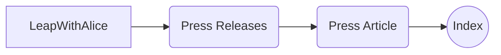
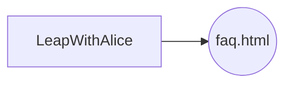
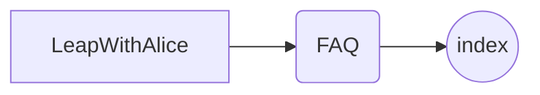
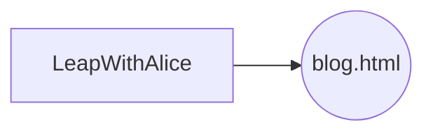
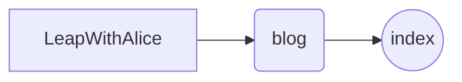

# LWA_Site_Revision

# LWA Site Update v1.2 08/07/2018

## Major Revisions

The Major revisions of 08/07/2018 will be listed here under their respective section. Go to the Table of Contents section, immediately following this section, to see what was changed, and where you can find a more detailed look at what was changed.

# Table of Contents:

### 1. Press Releases Page Added
### 2. Edited the Main Site
### 3.  Added Styles to Site
### 4. Added Images
### 5. Changed FAQ
### 6. Changed Blog

## 1. Press Release File Changes
The file layout for each article are as follows:

### URL Path Layout:
	leapwithalice.io/press-releases/article/

### Visual Layout:

In order to prevent a cluster of files in the main public_html folder, I have included press releases in their own folder structure.  I have added the following folders to the Press Release Folder:

### Folders / Files Added:
1. orlando-is-at-the-edge
	  - index.html
 2. desperate-need-ar
	 - index.html
 3. energize-students
  	  - index.html
 4.  reimagine-education
      - index.html
 5.  securing-classrooms
	 - index.html
 6.  storytelling
 	  - index.html
 7. teachers-students
	  - index.html
 8. toys-for-learning
    - index.html

### Page Contents:

Updated page contents of the main press release page to incldue an **image**, a **short description**, a **date**, and a **source**, and a **read more** button for each article. On each individual article page I include a **picture** from the article, the **article** itself, and a **related articles** section.
The related article sections contains other press releases available on our site. These can be easily navigated to.

## 2. Edits to Main Site

- Fixed links in header/footer/nav

- Added link to Press Release from main site
- Made content enabling future contact section functionality
- Fixed mobile layout issues
- Added media boxes for partner carousel
- Fixed carousel to rotate automatically
- Fixed mobile issues with Whitepaper links
- Update Roadmap to reflect **newest** Whitepaper

## 3. Styles Added to Site

 - Changed styling of press release and blog pages to be more cohesive and consistent throughout the site.
 - Improved Mobile site functionality and consistency with styling
 - Fixed dropdown styling issues

## 4. Images Added

 - Added images for Media Box Partner Carousel
 - Added Alex to Team Members section

## 5. Changed FAQ
Updated FAQ file tructure to a more pleasing structure / layout described first with diagrams.

##### (Squares Represent Folders, Circles represent Files)

### Old Leap With Alice FAQ Layout:
	leapwithalice.io/faq.html

### New Leap With Alice FAQ Layout:
	leapwithalice.io/FAQ/

## 6. Changed Blog

Similar to FAQ, Blog is described below and how it was changed. You may have noticed some stylized changes as well, but that is less important than file structure.

### Squares Represent Folders, Circles represent Files:

### Old Leap With Alice Blog Layout:
	leapwithalice.io/blog.html

### New Leap With Alice Blog Layout:
	leapwithalice.io/blog/

# /v1.2
